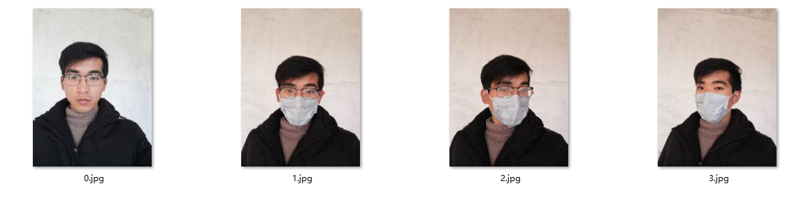

# MFHRD (Masked-Face Hallucination and Recognition Dataset in Real-World)

**发起背景**: “新冠肺炎”（COVID-19）疫情下，居民的出行都离不开口罩，特别是在医院、社区、企业等人员密集场所，随着企业相继复工，人脸口罩检测、面部遮挡人脸识别等一系列AI智慧解决方案成为社会公共安全的重要需求，帮助实现智慧访客管控，企业人员安防识别闸机以及人脸考勤机的功能升级，适应口罩蒙面遮挡的疫情下的实际应用环境。

同时也为今后可能的类似公共安全事件智能管控积累数据资源，现拟发起面部遮挡的人脸数据集建设项目。对于实际场景中的光照、口罩遮挡、表情变化、尺度变化等问题，通过收集不同拍摄设备，不同视距，多角度，多光照条件的实际口罩人脸图像。为实际场景下的人脸口罩检测、面部遮挡人脸的复原重建等具体行业问题提供无监督训练数据集。

**发起单位**：武汉工程大学智能机器人湖北省重点实验室

联系人：王彬

联系方式：15955788606@163.com

## 蒙面人脸数据集收集准则

- 包含**一张正面人脸图像**（标准同证件照）和**同一人**多张（大于2）佩戴口罩的图像，图像中仅含有一张人脸。口罩可使用棉质口罩、医用外科口罩、或N95等口罩，也可使用半遮蔽的防毒面具等。不可佩戴墨镜。
- 人脸图像偏转角度范围，左右角度±30度，侧脸角度±30度。人脸在图像中占比 [40%, 60%]，且人脸在图像中近似居中，与图像边界存在应存在1/10的距离（较整幅图像的长宽而言）。
- 图像不宜过度曝光。
- 拍摄时，请勿使用美颜相机。

## Examples

  
其中 0.jpg 文件是正面人脸，其余为带口罩人脸。不对背景作特殊要求。

数据提交网址 [数据提交](http://47.111.93.62:8080/worksystem/html/page/masked-face/Add.html)，如果您有合适的数据集，请发送至邮箱 15955788606@163.com， 感谢您的贡献。

## License

*研究人员只能将数据库用于非商业研究和教育用途，您提交数据默认您同意在以上用途内使用这些数据。*

*Researcher shall use the Database only for non-commercial research and educational purposes. When you submit data, you agree that we will use the data for the above purposes.*
